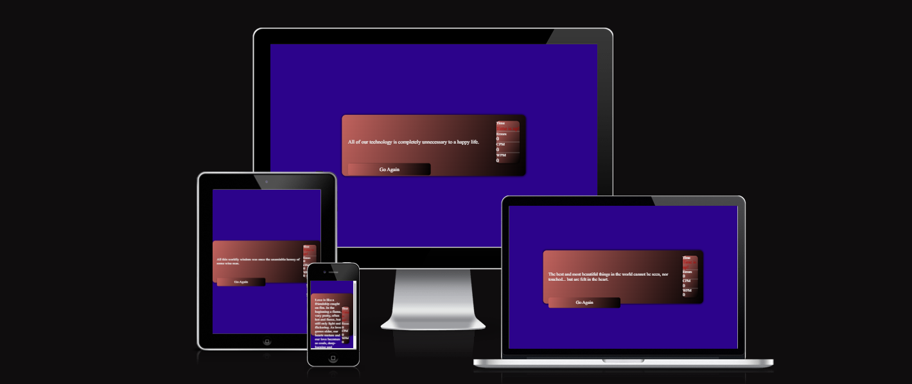

# Typing Speed Test

This project is a typing speed game that fetches a random quote from an API.
Wich allows the user to type them as quickly and accurate as possible with a live feedback showing errors
word per minute (WPM) and characters per minute (CPM)

## Features
- Fetch random quotes from the quotable API
- Splits up all characters to separate span elements.
- Tracks and display typing errors.
- Displays and calculates WPM and CPMs based on correct typed characters
- A timer that start to count down from 60 seconds
- Timer that changes color based on the time remaining ( 60 seconds white, 30 seconds yellow, 15 seconds red)
- Restart button to reset the Errors/Cpm/Wpm and Timer.

## Features to implement
- Make a border that fills up during the 60 seconds the game is active.
- implement different stages of the game, so the user can choose different times, 2,3 or 5 minutes. 

## Technologies Used
- HTML 
- CSS
- JavaScript
- [Quotable API](https://api.quotable.io)

## Setup and Usage
1. Clone the repository: https://github.com/Seafzz/PP2
2. Open the index.html with you web browser to start the game.

## Known Bugs
After the times run out and you press Go Again, it does not call for a new quote. (Refreshing the page does.)

Counters are currently not counting as intended and shows wrong values to what is expected.

## Manual testing
- Google Chrome no issues.
- Microsoft Edge no issues.
- Mozilla firefox no issues.
- safari no issues.

## Validating
- HTML validator: Passed without errors
- CSS validator : Passed without errors

    

            
Valid CSS!

    
- JavaScript validator
- Passed through with one error: One unused variable (restart) called in the HTML for the button.

## Acknowledgments/Credits
- Sean, classmate for suggestions/brainstorming
- WebDevSimplified (YouTube guide for API): https://www.youtube.com/watch?v=R-7eQIHRszQ&t=72
- CodingNepal (YouTube guide for counters): https://www.youtube.com/watch?v=Hg80AjDNnJk&t=1423s
- WaisAyam (YouTube guide for color/layout): https://www.youtube.com/watch?v=Y70pPpc1CUE

## Deployment
- The site was deployed to GitHub pages. The steps to deploy are as follows: 
  - In the GitHub repository, navigate to the Settings tab 
  - From the source section drop-down menu, select the Master Branch
  - Once the master branch has been selected, the page will be automatically refreshed with a detailed ribbon display to indicate the successful deployment. 

The live link can be found here - https://github.com/Seafzz/PP2